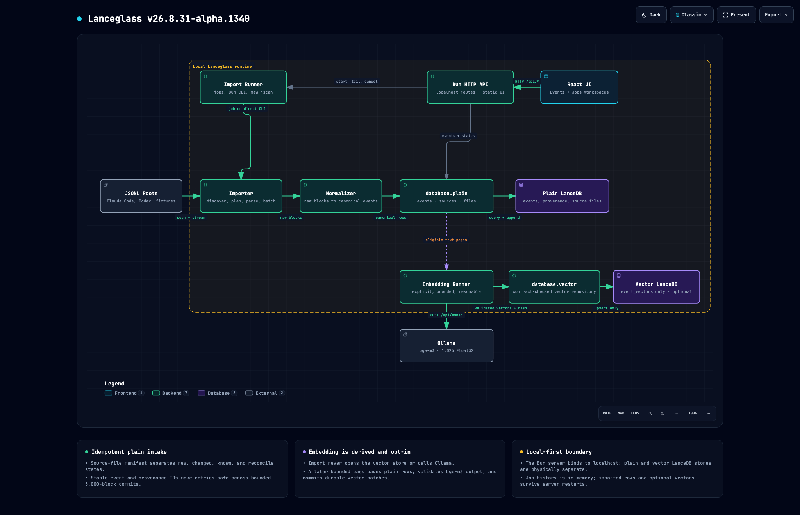

# Lanceglass documentation

This directory contains the public system map, UI evidence, extension
contracts, and implementation notes for Lanceglass `v26.9.1-alpha.1401`.

## System map

The image below is ordinary relative-path Markdown, so it renders directly in
GitHub without an external image host.

- [Open the interactive architecture artifact](./lanceglass-architecture.html)
- [Read the complete UI state gallery](./ui-state-gallery.md)
- [Open the public static fixture demo](https://lanceglass-fixture-demo.laris.workers.dev/)
- [Implement an embedding provider plugin](./embedding-provider-plugins.md)
- [Implement a vector visualization plugin](./vector-visualization-plugins.md)

## Screenshot provenance

The UI gallery was captured from the production build at 1600×1000 with
`ego-browser`. It uses only the repository's synthetic fixture plus two
synthetic long-form messages for vector-map proof. The disposable database and
embedding endpoint lived under `/tmp/lanceglass-public-demo`; no personal agent
history, credentials, or private filesystem paths appear in the images.

The Cloudflare demo screenshots use the same production UI and a fixture API
bundled directly into the Worker. The deployment has no KV, D1, R2, database,
or secret binding. Its write-looking actions are deterministic simulations and
never persist state.
